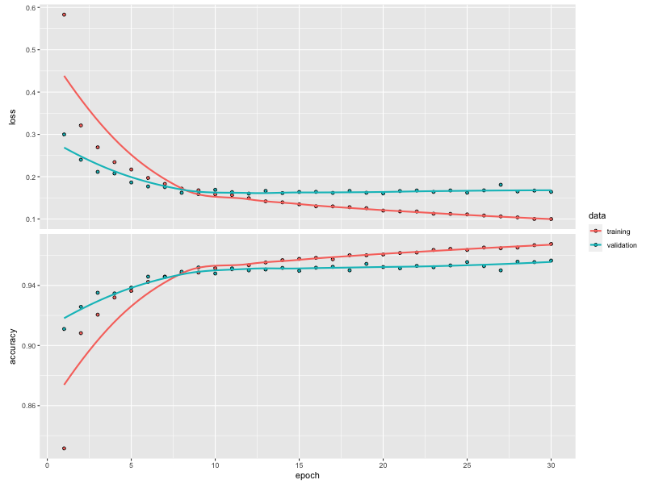
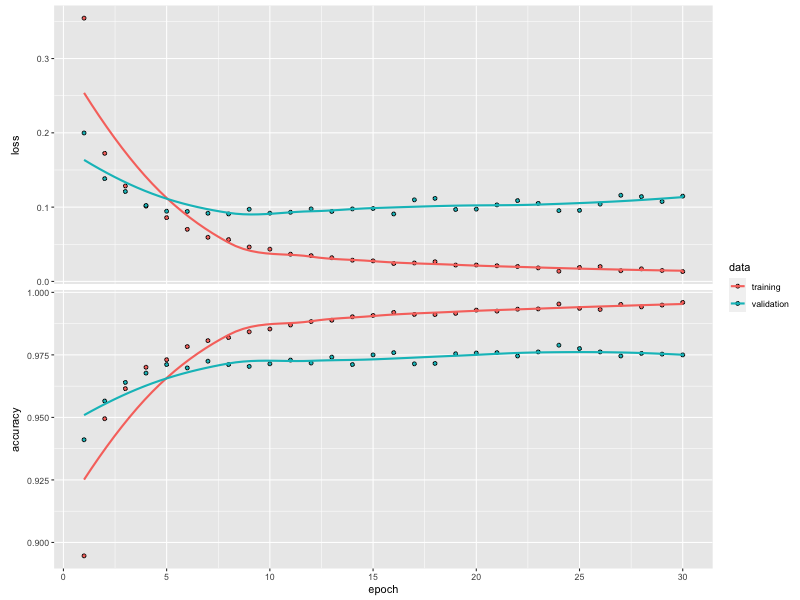
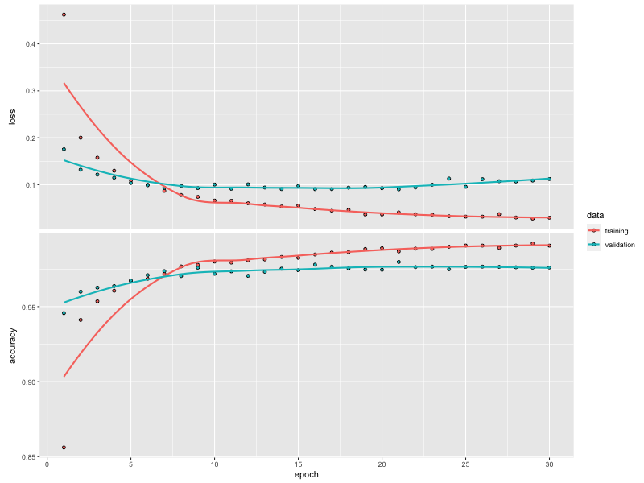
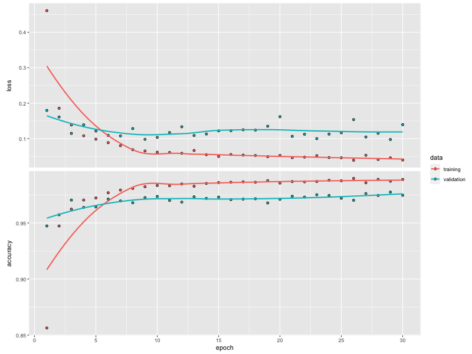
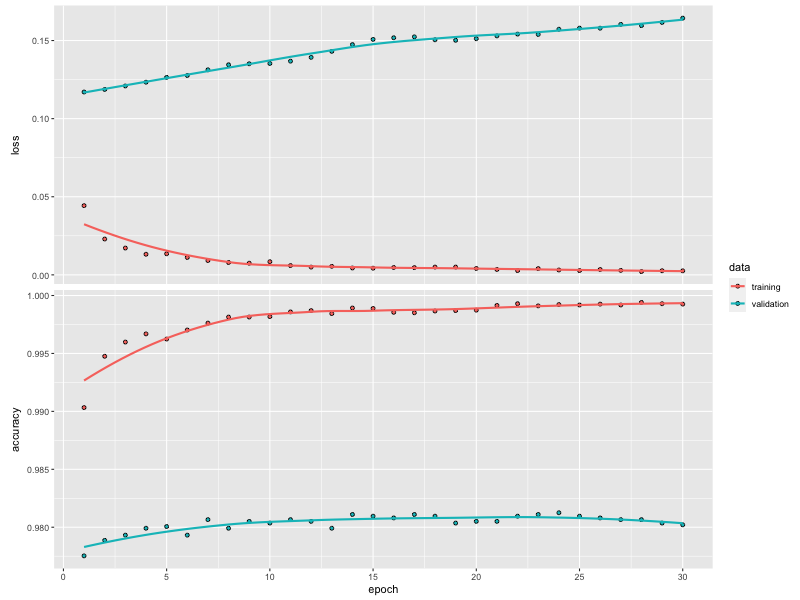
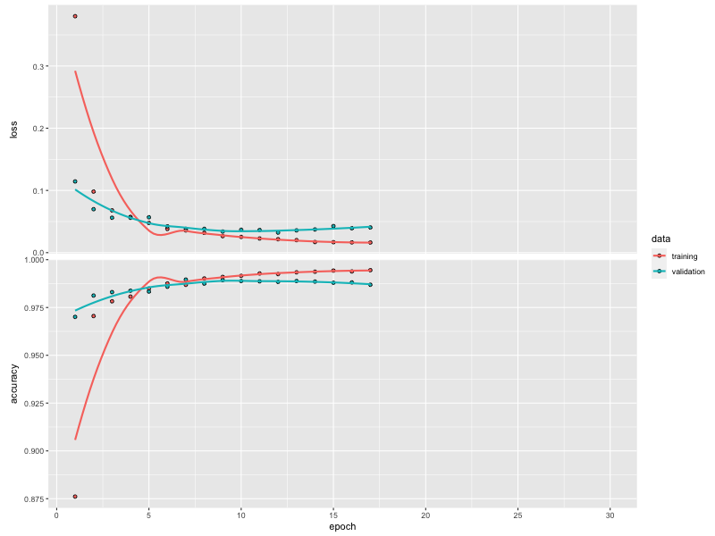

```{r setup, include=FALSE}
knitr::opts_chunk$set(echo = TRUE, warning = FALSE, messages = FALSE, tidy.opts=list(width.cutoff=40),tidy=TRUE)
```

> Note that all the models and its associated artifacts defined in this notebook are already pre-trained and exported as H5 files and loaded where needed. This is due to the lenghtly process of re-building algos in each session. 

## Requirements

I chose to work with only keras, therefore we only need the tidyverse and keras package. Loaded the `htmlwidgets` and `webshots` additionally to save history plots in the viewer page.

```{r req, results='hide', message=FALSE}

library(tidyverse)
library(keras)

```

## 1. Classify handwritten digits on the MNIST data (15 points)

Take the famous “MNIST dataset” with handwritten digits. Your task is to correctly classify the writings into one of the ten digits. Images are in exactly the same format as we saw the fashion products: 28x28 pixel grayscale images. The task is to build deep neural net models to predict digits. You can use either h2o or keras; to get the data, go to the corresponding [Kaggle page](https://www.kaggle.com/competitions/digit-recognizer/data) or use the keras::dataset_fashion_mnist() function.

### a.) What would be an appropriate metric to evaluate your models? Why?

Since this is a classification problem, a good evaluation metric would be AUC based on the loss function we define beforehand, let it be a categorical crossentropy or whatnot. The categorical crossentropy is well suited to classification tasks, since one example can be considered to belong to a specific category with probability 1, and to other categories with probability 0.
 
### b.) Get the data and show some example images from the data.

Loading the training data which I will split into training, validation, and test. The test data supplied by kaggle is only for submission and not testing.

```{r}
# got the data from kaggle
full <- read_csv("../data/digits/train.csv")
head(full[1:10])
```

```{r}

#present samples
xy_axis <- as_tibble(expand.grid(x = 1:28, y = 28:1))
plot_theme <- list(
    raster = geom_raster(hjust = 0, vjust = 0),
    gradient_fill = scale_fill_gradient(low = "white", high = "black", guide = "none"),
    theme = theme(
        axis.line = element_blank(),
        axis.text = element_blank(),
        axis.ticks = element_blank(),
        axis.title = element_blank(),
        panel.background = element_blank(),
        panel.border = element_blank(),
        panel.grid.major = element_blank(),
        panel.grid.minor = element_blank(),
        plot.background = element_blank()
    )
)

showImages <- function(data, row_indices) {
    list_of_plots <- map(row_indices, ~{
        cbind(xy_axis, fill = t(data[.x, -1])) |>
            ggplot(aes(x, y, fill = fill)) +
            coord_fixed() +
            plot_theme
    })
    do.call(gridExtra::grid.arrange, list_of_plots)
}
showImages(full, 1:12)
```

### c.) Train a simple fully connected network with a single hidden layer to predict the digits. Do not forget to normalize the data similarly to what we saw with FMNIST in class.

The general pre-processing of image classes includes the following steps:
1. Re-scale pixel values
2. Split data to train, validation and test set -- I have used an 80-20 splits
3. Separate features and labels as matrices

```{r}

#rescale pixel values to avoid distortion
full_set <- mutate(full,
    label = as.factor(label),
    across(-label, ~./255)
)

#Data partition to work and test set
set.seed(1234)
ind<-sample(nrow(full_set),size=floor(0.8*nrow(full_set)))
work<-full_set[ind,]
test<-full_set[-ind,]

#split work set further to train and validation set, put aside the test set
set.seed(1234)
ind<-sample(nrow(work),size=floor(0.8*nrow(work)))
train<-work[ind,]
valid<-work[-ind,]

tbl_train <- as.tibble(train)
tbl_valid <- as.tibble(valid)

# Separate x & rescale
data_train_x <- as.matrix(select(tbl_train, -label))
data_valid_x <- as.matrix(select(tbl_valid, -label))

# Separate y & one-hot encoding
data_train_y <- to_categorical(tbl_train$label, 10)
data_valid_y <- to_categorical(tbl_valid$label, 10)

```

Let's initialize the keras sequential model where I have decided to build a single hidden layer with 32 nodes and a ReLU activation function within the hidden layer, while softmax was initialized in the output layer which is the best practice for predicting a label among multiple categories. Lastly, we are dropping out sets of inputs with a rate of 20% to regularize and reduce overfitting (i.e. randomly selected neurons are ignored during training).

```{r keras-model}

#connected network with a single hidden layer and 32 nodes with relu hidden layer and softmax as an output activation layer since we need to predict one label from multiple categories.
simple_keras <- keras_model_sequential()
simple_keras |>
    layer_dense(units = 32, activation = 'relu', input_shape = c(784)) |>
    layer_dropout(rate = 0.2) |>
    layer_dense(units = 10, activation = 'softmax')
summary(simple_keras)

```

To compile the model, I have chosen the categorical cross-entropy loss function for the loss function for the reason discussed in the very first exercise, and an Adam Optimizer to implement SGD.

```{r}
# use the Adam Optimizer for gradient descent strategy (stochastic gradient descent method that is based on adaptive estimation of first-order and second-order moments.)

# use categorical cross entropy because we have 10 categories
compile(
    simple_keras,
    loss = 'categorical_crossentropy',
    optimizer = optimizer_adam(),
    metrics = c('accuracy')
)
```

When fitting the neural net to our training set, we can see that there are 32*785 parameters in the first hidden layer, which translates to 784 input weights and 1 bias for each node which totals to 25120.

> Note: I wanted to save the Markdown compiling time, hence, I saved the generated history plots and model parameters in my working folder.

```{r keras-model-training}

# history_simple <- fit(
#     simple_keras, data_train_x, data_train_y,
#     epochs = 30, batch_size = 20,
#     validation_data = list(data_valid_x, data_valid_y)
# )

#run these in the console because dev.off does not properly work with markdown's inline plotting
#png('history_simple.png', width = 800, height = 600)
#plot(history_simple)
#invisible(dev.off())

#save model
keras::save_model_hdf5(simple_keras, 'models/simple_keras.h5')

#load model
simple_keras <- keras::load_model_hdf5('models/simple_keras.h5')

#load plot


```

With the simplest model, we are already achieving a 95,5% accuracy on the validation set.

```{r keras-model-evaluation}
evaluate(simple_keras, data_valid_x, data_valid_y)
```

### d.) Experiment with different network architectures and settings (number of hidden layers, number of nodes, type and extent of regularization, etc.). Train at least 5 models. Explain what you have tried, what worked and what did not. Make sure that you use enough epochs so that the validation error starts flattening out - provide a plot about the training history.

### + Nodes + Dropout rate 

Let's see what changes if we increase the number of nodes and the dropout rate. We are now estimating 300*785 parameters with 300 bias parameters estimated.

```{r}

keras_l <- keras_model_sequential()
keras_l |>
    layer_dense(units = 300, activation = 'relu', input_shape = c(784)) |>
    layer_dropout(rate = 0.4) |>
    layer_dense(units = 10, activation = 'softmax')
summary(keras_l)

```

```{r}

compile(
    keras_l,
    loss = 'categorical_crossentropy',
    optimizer = optimizer_adam(),
    metrics = c('accuracy')
)

```

The model has marginally improved and now has a validation accuracy of 97.3%. The training accuracy increases with a larger pace than its pair calculated for the validation set. It seems that the loss at each epoch for the validation set is upward sloping.

```{r keras-model-training}

# history_l <- fit(
#     keras_l, data_train_x, data_train_y,
#     epochs = 30, batch_size = 30,
#     validation_data = list(data_valid_x, data_valid_y)
# )

#run these in the console because dev.off does not properly work with markdown's inline plotting
# png('history_l.png', width = 800, height = 600)
# plot(history_l)
# invisible(dev.off())

keras::save_model_hdf5(keras_l, 'models/keras_l.h5')

keras_l <- keras::load_model_hdf5('models/keras_l.h5')



```

```{r keras-model-evaluation}
evaluate(keras_l, data_valid_x, data_valid_y)
```

### + Nodes + Hidden layers + Dropout layers

Let's try a much larger network starting with 300 nodes in the first hidden layer and 3 hidden layers in total. I decided try decrease the dropout rate gradually from 40%. 

```{r}

keras_xl <- keras_model_sequential()
keras_xl |>
    layer_dense(units = 300, activation = 'relu', input_shape = c(784)) |>
    layer_dropout(rate = 0.4) |>
    layer_dense(units = 150, activation = 'relu') |>
    layer_dropout(rate = 0.3) |>
    layer_dense(units = 50, activation = 'relu') |>
    layer_dropout(rate = 0.2) |>
    layer_dense(units = 10, activation = 'softmax')
summary(keras_xl)

```

```{r}

compile(
    keras_xl,
    loss = 'categorical_crossentropy',
    optimizer = optimizer_adam(),
    metrics = c('accuracy')
)

```

```{r keras-model-training}
# history_xl <- fit(
#     keras_xl, data_train_x, data_train_y,
#     epochs = 30, batch_size = 30,
#     validation_data = list(data_valid_x, data_valid_y)
# )

#run these in the console because dev.off does not properly work with markdown's inline plotting
# png('history_xl.png', width = 800, height = 600)
# plot(history_xl)
# invisible(dev.off())

keras::save_model_hdf5(keras_xl, 'models/keras_xl.h5')

keras_xl <- keras::load_model_hdf5('models/keras_xl.h5')



```

It managed to improve the results as expected and now we have a 97.4% validation accuracy. Generally, more layers and nodes mean more flexibility, but at a certain point the model starts to learn the generated noises of the train set and performs worse on the validation set. The next step would be implement a data augmentation strategy or regularize the dense layers more aggressively so that the model is less likely to learn the noise.

```{r keras-model-evaluation}
evaluate(keras_xl, data_valid_x, data_valid_y)
```

### + Nodes + Hidden layers + Optimized Dropout layers + MaxNorm Kernel Constraint Regularization + Epoch

According to the founding of [Nitish Srivastava](https://jmlr.org/papers/volume15/srivastava14a/srivastava14a.pdf) in the optimal dropout rate, I will set the input layer dropout rate to 10% to avoid the fanning out of input values, and increase the size of the network. Also, there is also evidence on the practice of implementing a kernel constraint_maxnorm kernel constraint on the hidden layers, thus avoid overfitting. constraint_maxnorm(2) will, if the L2-Norm of your weights exceeds 2, scale your whole weight matrix by a factor that reduces the norm to 2. Constraining the weight matrix directly is another kind of regularization. If you use a simple L2 regularization term you penalize high weights with your loss function. With this constraint, you regularize directly. Many suggest that it works quite well with a dropout layer.

```{r}

keras_xxl <- keras_model_sequential()
keras_xxl |>
    layer_dense(units = 600, activation = 'relu', kernel_constraint = constraint_maxnorm(2), input_shape = c(784)) |>
    layer_dropout(rate = 0.1) |>
    layer_dense(units = 400, activation = 'relu', kernel_constraint = constraint_maxnorm(2)) |>
    layer_dropout(rate = 0.5) |>
    layer_dense(units = 300, activation = 'relu', kernel_constraint = constraint_maxnorm(2)) |>
    layer_dropout(rate = 0.4) |>
    layer_dense(units = 150, activation = 'relu', kernel_constraint = constraint_maxnorm(2)) |>
    layer_dropout(rate = 0.3) |>
    layer_dense(units = 50, activation = 'relu', kernel_constraint = constraint_maxnorm(2)) |>
    layer_dropout(rate = 0.2) |>
    layer_dense(units = 10, activation = 'softmax')
summary(keras_xxl)

```

```{r}

compile(
    keras_xxl,
    loss = 'categorical_crossentropy',
    optimizer = optimizer_adam(),
    metrics = c('accuracy')
)

```

Again we have in overall a slightly worse accuracy on both the train and test set, but at the same time we can see from the loss-accuracy plot that both have stagnating for the validation set. The test and validation curves are not smoothed to one-another and the test metrics overcome marginally the out-of-sample performance. This indicates that our model can improve in terms of generalization.

```{r keras-model-training}

# history_xxl <- fit(
#     keras_xxl, data_train_x, data_train_y,
#     epochs = 30, batch_size = 30,
#     validation_data = list(data_valid_x, data_valid_y)
# )

#run these in the console because dev.off does not properly work with markdown's inline plotting
# png('history_xxl.png', width = 800, height = 600)
# plot(history_xxl)
# invisible(dev.off())

keras::save_model_hdf5(keras_xxl, 'models/keras_xxl.h5')

keras_xxl <- keras::load_model_hdf5('models/keras_xxl.h5')



```

```{r keras-model-evaluation}
evaluate(keras_xxl, data_valid_x, data_valid_y)
```

### + Classical SGD optimizer

Many suggests that the classical SGD optimizer can outperform in some cases the Adam optimizer. Let's validate whether it can achieve a better performance if we estimate the very same model with only changing the optimization strategy.

```{r}

#copy keras xxl
keras_sgd <- keras_xxl

summary(keras_sgd)

compile(
    keras_sgd,
    loss = 'categorical_crossentropy',
    optimizer = optimizer_sgd(),
    metrics = c('accuracy')
)

```

It was indeed the case we have a slightly better accuracy on both the train and validation set (98,2% in the latter). The lack of convergence is also due to the optimization technique which may require more iterations to converge.

```{r keras-model-training}

# history_sgd <- fit(
#     keras_sgd, data_train_x, data_train_y,
#     epochs = 30, batch_size = 30,
#     validation_data = list(data_valid_x, data_valid_y)
# )

#run these in the console because dev.off does not properly work with markdown's inline plotting
# png('history_sgd.png', width = 800, height = 600)
# plot(history_sgd)
# invisible(dev.off())

keras::save_model_hdf5(keras_sgd, 'models/keras_sgd.h5')

keras_sgd <- keras::load_model_hdf5('models/keras_sgd.h5')



```

```{r keras-model-evaluation}
evaluate(keras_sgd, data_valid_x, data_valid_y)
```

### CNN

We have seen that training a fully connected neural network was able to give us a validation accuracy of 97.1% when using multiple layers and regularization strategies suggested in the best practice. It's pretty solid for a classifier but let's see how a CNN can improve the result even more.

First we need to reshape our dataset in preparation of CNN

```{r reshape-for-conv}
data_train_2d_x <- array_reshape(data_train_x, c(nrow(data_train_x), 28, 28, 1))
data_valid_2d_x <- array_reshape(data_valid_x, c(nrow(data_valid_x), 28, 28, 1))
```

We have 3 x 3 weight parameters for each filter + bias. This is set by the `kernel_size` parameter which downscale the image from 28x28 to 26*26. With the `max_pooling` parameter, we further condense the image dimensions with grouping 2x2 pixels together and essentially halving the resolution after each dense layer. In addition, like in the feed-forward network, I equipped the model with dropout layers and kernel constraints.

```{r cnn-definition}

cnn_model <- keras_model_sequential()
cnn_model |>
    layer_conv_2d(filters = 64,kernel_size = c(3, 3),activation = 'relu',input_shape = c(28, 28, 1)) |>
    layer_dropout(rate = 0.1) |>
    layer_max_pooling_2d(pool_size = c(2, 2)) |>
    layer_conv_2d(filters = 64,kernel_size = c(3, 3), kernel_constraint = constraint_maxnorm(2), activation = 'relu') |>
    layer_dropout(rate = 0.2) |>
    layer_max_pooling_2d(pool_size = c(2, 2)) |>
    layer_conv_2d(filters = 32,kernel_size = c(3, 3), kernel_constraint = constraint_maxnorm(2), activation = 'relu') |>
    layer_dropout(rate = 0.2) |>
    layer_flatten() |>
    layer_dense(units = 16, activation = 'relu') |>
    layer_dense(units = 10, activation = 'softmax')

```

```{r cnn-summary}
summary(cnn_model)
```

Since this is a much more complex network, I have imposed callbacks on the learning. One of them is the early stopping which monitors the validation loss and stops the process if the subsequent 5 epochs are not improving via the `patience` parameter. This way, we can avoid further overfitting on the train set. Along with that, it is a good idea to add a checkpoint callback to be able to revert back to the best model. 

```{r cnn-setup}

compile(
    cnn_model,
    loss = 'categorical_crossentropy',
    optimizer = optimizer_adam(),
    metrics = c('accuracy')
)

#define early stopping callback
early_stop <- keras::callback_early_stopping(monitor = 'val_loss', patience=5)

#define checkpoint callback
checkpoint <- keras::callback_model_checkpoint(filepath = 'models/best_cnn.h5', monitor = 'val_loss', save_best_only = TRUE)

```

```{r cnn-train}

# history_cnn <- fit(
#     cnn_model, data_train_2d_x, data_train_y,
#     epochs = 30, batch_size = 32,
#     validation_data = list(data_valid_2d_x, data_valid_y),
#     steps_per_epoch = nrow(data_train_y)/32,
#     callbacks = c(early_stop, checkpoint)
# )

#run these in the console because dev.off does not properly work with markdown's inline plotting
# png('history_cnn.png', width = 800, height = 600)
# plot(history_cnn)
# invisible(dev.off())

best_cnn <- keras::load_model_hdf5('models/best_cnn.h5')



```

The algorithm callback decided to stop after 17 epochs because the validation loss has not improved in the last 5 steps. Loading the best model, CNN yielded the highest accuracy so far with a value close to 99% (98.84%) on the validation set.

```{r}
evaluate(best_cnn, data_valid_2d_x, data_valid_y)
```

### CNN w/ data augmentation

The last model I wanted to look at was a CNN with data augmentation method. For that we need to initialize train and validation data generators which rotate, zoom, shifts every image in all sorts of ways so that we have a larger sample for the train and validation fit.

```{r}

cnn_aug <- cnn_model

compile(
    cnn_aug,
    loss = 'categorical_crossentropy',
    optimizer = optimizer_adam(),
    metrics = c('accuracy')
)

#define early stopping callback
early_stop <- keras::callback_early_stopping(monitor = 'val_loss', patience=5)

#define checkpoint callback
checkpoint <- keras::callback_model_checkpoint(filepath = 'models/best_cnn_aug.h5', monitor = 'val_loss', save_best_only = TRUE)

```

```{r data-augmentation}

batch_size <- 64

train_datagen <- image_data_generator(
    rotation_range = 20,
    width_shift_range = 0.1,
    height_shift_range = 0.1,
    shear_range = 0.1,
    zoom_range = 0.1
)

valid_datagen <- image_data_generator()

train_generator <- flow_images_from_data(
    x = data_train_2d_x,
    y = data_train_y,
    generator = train_datagen,
    batch_size = batch_size
)

valid_generator <- flow_images_from_data(
    x = data_valid_2d_x,
    y = data_valid_y,
    generator = valid_datagen,
    batch_size = batch_size
)
```

The algo decided to revert back after the 24th epoch. The history figure looks healthy in a sense that validation materics are not volatile and surprisingly the model performs better on predicting the validation set.

```{r cnn-with-augmentation}

# history_cnn_aug <- fit(
#     cnn_model,
#     train_generator,
#     epochs = 30,
#     steps_per_epoch = nrow(data_train_x) / batch_size,
#     validation_data = valid_generator,
#     validation_steps = nrow(data_valid_x) / batch_size,
#     callbacks = c(early_stop, checkpoint)
# )

#run these in the console because dev.off does not properly work with markdown's inline plotting
# png('history_cnn_aug.png', width = 800, height = 600)
# plot(history_cnn_aug)
# invisible(dev.off())

best_cnn_aug <- keras::load_model_hdf5('models/best_cnn_aug.h5')


```

Evaluating the the model on the validation set, we managed to improve the accuracy even more to 99.17% on the validation set. I would expect this number to improve as we increase the number of epochs and patience parameter allowing more time for the algorithm to figure out the image modifications we made.

```{r}
evaluate(best_cnn_aug, data_valid_2d_x, data_valid_y)
```

### e.) Choose a final model and evaluate it on the test set. How does test error compare to validation error?

The final model based on the preliminary training of several ones is the CNN with data augmentation methods. The test error is marginally larger than that of the validation error (0.027 vs, 0.021) and the accuracy is slightly worse (99.15%) but still outperforms previous validation metrics before.

```{r}

tbl_test <- as.tibble(test)

# Separate y & one-hot encoding
data_test_x <- as.matrix(select(tbl_test, -label))
data_test_y <- to_categorical(tbl_test$label, 10)

data_test_2d_x <- array_reshape(data_test_x, c(nrow(data_test_x), 28, 28, 1))

evaluate(best_cnn_aug, data_test_2d_x, data_test_y)

```

2. Hot dog or not hot dog? (15 points)

In this problem you are going to predict if a certain image containing food is hot dog or is something else. Motivation for this comes from the comedy show Silicon Valley (see [here](https://www.youtube.com/watch?v=vIci3C4JkL0)).

The data can be found in the course repo and is originally downloaded from [here](https://www.kaggle.com/datasets/dansbecker/hot-dog-not-hot-dog). You will use the test data for validation.

Now your data is in actual image formats so it is your task to reformat so that keras understands them. I give you hints for how to do that.

### a.) Show two images: one hot dog and one not hot dog. (Hint: You may use knitr::include_graphics() or install the imager package to easily accomplish this.)

Hot dog:

```{r}

#hot dog
knitr::include_graphics('../data/hot-dog-not-hot-dog/train/hot_dog/3905030.jpg')

```

Not hot dog:

```{r}

#not hot dog
knitr::include_graphics('../data/hot-dog-not-hot-dog/train/not_hot_dog/817533.jpg')

```

### b.) What would be a good metric to evaluate such a prediction?

As it is a classification problem, AUC or accuracy oh hitting the right classification would be a good metric. As a loss function, I would choose the binary cross entropy because now we have only two classes, hot dog or not hot dog.

### c.) To be able to train a neural network for prediction, let’s first build data batch generator functions as we did in class for data augmentation (train_generator and valid_generator). Take care of the following differences:

- Here you should use the flow_image_from_directory() function instead of the flow_image_from_data(). The first parameter of this function is the path to the directory where your train/test data is stored (according to the help: “path to the target directory. It should contain one subdirectory per class.”).

- You should use simple image_data_generator() functions with only one rescale transformation (rescale = 1/255 achieves the same as what we did in class directly: brings the pixel values down to the 0-1 range). Do not use any actual data augmentation steps.

- Set the target_size parameter so you know what input shape you have to set for your network. (Hint: The default is c(256, 256). Choose c(128, 128) instead to compress your information and decrease the number of parameters you are going to have for training.)

- Set the class_mode parameter to “binary” (the default is “categorical”).

```{r data-augmentation}

batch_size <- 32

train_datagen <- image_data_generator(
  rescale = 1/255
)

valid_datagen <- image_data_generator(
  rescale = 1/255
)

train_generator <- flow_images_from_directory(
    '../data/hot-dog-not-hot-dog/train/',
    target_size = c(128, 128),
    generator = train_datagen,
    batch_size = batch_size,
    class_mode = 'binary',
    classes = c('hot_dog', 'not_hot_dog'),
    color_mode="rgb",
    shuffle = TRUE
)

valid_generator <- flow_images_from_directory(
    '../data/hot-dog-not-hot-dog/test/',
    target_size = c(128, 128),    
    generator = valid_datagen,
    batch_size = batch_size,
    class_mode = 'binary',
    classes = c('hot_dog', 'not_hot_dog'),
    color_mode="rgb",
    shuffle = TRUE
)

```

### d.) Build a simple convolutional neural network (CNN) to predict if an image is a hot dog or not. Evaluate your model on the test set. (Hint: Account for the fact that you work with colored images in the input_shape parameter: set the third dimension to 3 instead of 1.)

I've used a very similar CNN model built in the previous exercise.

- ReLU activation functions within the nodes of hidden layers.
- Kernel size of 3x3
- The input shape is 128x128 pixels
- A max pooling of 2x2 squares are applied on each layer.
- Batch normalization helping to standardize layer inputs so that we are centered in the linear section of the activation function + dropout layers ensuring that we rescale weights beyond 2 and sampling the number of nodes active.
- Sigmoid as an output activation function for exclusive categorization, because it is more commonly used for binary classification.

```{r}

hd_cnn <- keras_model_sequential()
hd_cnn |>
    layer_conv_2d(filters = 128,kernel_size = c(3, 3),activation = 'relu', input_shape = c(128, 128, 3)) |>
    layer_batch_normalization() |>
    layer_max_pooling_2d(pool_size = c(2, 2)) |>
    layer_dropout(rate = 0.1) |>
    layer_conv_2d(filters = 128,kernel_size = c(3, 3), activation = 'relu') |>
    layer_batch_normalization() |>
    layer_max_pooling_2d(pool_size = c(2, 2)) |>
    layer_dropout(rate = 0.2) |>
    layer_conv_2d(filters = 64,kernel_size = c(3, 3),  activation = 'relu') |>
    layer_batch_normalization() |>
    layer_dropout(rate = 0.2) |>
    layer_flatten() |>
    layer_dense(units = 32, activation = 'relu') |>
    layer_dense(units = 1, activation = 'sigmoid')

summary(hd_cnn)

```

Besides, compiling with an Adam SGD optimizer, I have initialized an early stopping and checkpoint callback with a patience of 10 epochs and target of validation loss. I have used a binomial cross-entropy for this problem because we have only two classes.

```{r cnn-setup}

hd_cnn |> compile(
  loss = "binary_crossentropy",
  optimizer = optimizer_adam(),
  metrics = c("accuracy")
)

#define early stopping callback
early_stop <- keras::callback_early_stopping(monitor = 'val_loss', patience=10)

#define checkpoint callback
checkpoint <- keras::callback_model_checkpoint(filepath = 'models/best_hd_cnn.h5', monitor = 'val_loss', save_best_only = TRUE)

```

Since it is a realtively small data, I have used a 32 unit of batch size.

```{r cnn-train}

# history_hot_dog <- hd_cnn |> fit(
#     train_generator,
#     epochs = 30,
#     validation_data = valid_generator,
#     validation_steps=valid_generator$n/batch_size,
#     steps_per_epoch=train_generator$n/batch_size,
#     callbacks = c(early_stop, checkpoint)
# )

# run these in the console because dev.off does not properly work with markdown's inline plotting
# png('history_hot_dog.png', width = 800, height = 600)
# plot(history_hot_dog)
# invisible(dev.off())

best_hd_cnn <- keras::load_model_hdf5('models/best_hd_cnn.h5')


```

It seems that the model struggles with generalization as the validation accuracy is worse than picking randomly with its 46%. Maybe we could try generating more data through augmentations so that we can take more granular steps with the gradient descent algorithm.

```{r}

evaluate(best_hd_cnn, valid_generator, steps = valid_generator$n/32)

```

### e.) Could data augmentation techniques help with achieving higher predictive accuracy? Try some augmentations that you think make sense and compare to your previous model.

Personally, I would apply all sorts of image modifications because these pictures are highly diverse and taken from many angles, environment, and proximity. I went with shifting, zooming, rotating and flipping at the end.

```{r data-augmentation}

batch_size <- 16

# image augmentation
train_datagen <- image_data_generator(
  rescale = 1/255,
  rotation_range = 40,
  width_shift_range = 0.3,
  height_shift_range = 0.3,
  shear_range = 0.3,
  zoom_range = 0.3,
  horizontal_flip=TRUE,
  fill_mode='nearest'
)

valid_datagen <- image_data_generator(
  rescale = 1/255
)

train_generator <- flow_images_from_directory(
    '../data/hot-dog-not-hot-dog/train/',
    target_size = c(128, 128),
    generator = train_datagen,
    batch_size = batch_size,
    class_mode = 'binary',
    classes = c('hot_dog', 'not_hot_dog'),
    color_mode="rgb",
    shuffle = TRUE
)

valid_generator <- flow_images_from_directory(
    '../data/hot-dog-not-hot-dog/test/',
    target_size = c(128, 128),    
    generator = valid_datagen,
    batch_size = batch_size,
    class_mode = 'binary',
    classes = c('hot_dog', 'not_hot_dog'),
    color_mode="rgb"
)

```

All other artifacts used for training the model remains the same including callbacks, and model compilation.

```{r cnn-train}

hd_cnn_aug <- hd_cnn

compile(
    hd_cnn_aug,
    loss = 'binary_crossentropy',
    optimizer = optimizer_adam(learning_rate = 1e-6),
    metrics = c('accuracy')
)

#define early stopping callback
early_stop <- keras::callback_early_stopping(monitor = 'val_loss', patience=10)

#define checkpoint callback
checkpoint <- keras::callback_model_checkpoint(filepath = 'models/best_hd_cnn_aug.h5', monitor = 'val_loss', save_best_only = TRUE)

```

```{r}

history_hot_dog_aug <- fit(
     hd_cnn_aug,
     train_generator,
     epochs = 30,
     validation_data = valid_generator,
     validation_steps=valid_generator$n/batch_size,
     steps_per_epoch=train_generator$n/batch_size
     #callback = c(early_stop, checkpoint)
 )

#run these in the console because dev.off does not properly work with markdown's inline plotting
# png('history_hot_dog_aug.png', width = 800, height = 600)
# plot(history_hot_dog_aug)
# invisible(dev.off())

best_hd_cnn_aug <- keras::load_model_hdf5('models/best_hd_cnn_aug.h5')


```

The model now performs better than randomly classifying pictures with its 60.5% accuracy.

```{r}

evaluate_generator(best_hd_cnn_aug, valid_generator, steps = valid_generator$n/batch_size)

```

### f.) (optional for +5 points) Try to rely on some pre-built neural networks to aid prediction. Can you achieve a better performance using transfer learning for this problem?

Let's download the VGG16 pre-trained model with 19 dense layers and 14.7 million of trainable parameters.

```{r use-imagenet-model}

#download VGG16 model
conv_base <- application_vgg16(weights='imagenet', include_top= FALSE, input_shape=c(128,128,3))

summary(conv_base)

```

```{r transfer-model-setup}

transfer_model <- keras_model_sequential() |>
    conv_base() |>
    layer_flatten() |>
    layer_dense(units = 256, activation = 'relu') |>
    layer_dropout(0.5) |> 
    layer_dense(units = 1, activation = 'sigmoid')

compile(
    transfer_model,
    loss = "binary_crossentropy",
    optimizer = optimizer_adam(learning_rate = 0.000001),
    metrics = c("accuracy")
)

#define early stopping callback
early_stop <- keras::callback_early_stopping(monitor = 'val_loss', patience=10)

#define checkpoint callback
checkpoint <- keras::callback_model_checkpoint(filepath = 'models/best_hd_transfer.h5', monitor = 'val_loss', save_best_only = TRUE)

```

```{r freeze-params}

#freeze weights of the transfer model (why would we need to re-estimate again)
freeze_weights(conv_base, to = 'block5_conv1')
summary(transfer_model)

```

```{r cnn-train}

history_hot_dog_trans <- fit(
    transfer_model,
    train_generator,
    epochs = 100,
    validation_data = valid_generator,
    validation_steps=length(valid_generator$labels)/batch_size,
    steps_per_epoch=length(train_generator$labels)/batch_size
    #callbacks = c(early_stop, checkpoint)
)

#run these in the console because dev.off does not properly work with markdown's inline plotting
png('history_hot_dog_trans.png', width = 800, height = 600)
plot(history_hot_dog_trans)
invisible(dev.off())

best_transfer <- keras::load_model_hdf5('models/best_hd_transfer.h5')

knitr::include_graphics('history_hot_dog_trans.png')

evaluate_generator(transfer_model, valid_generator, steps = length(valid_generator$labels))

```
